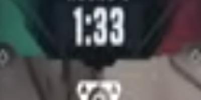

the valorant round clipper, this is an ai engineering project

moondream, a model served by ollama, looks at 1 frame/5seconds of a valorant vod and picks up the amount of time showing in the timer using the vision model.

there are criterias of how this information is used to figure out when a round starts or ends

